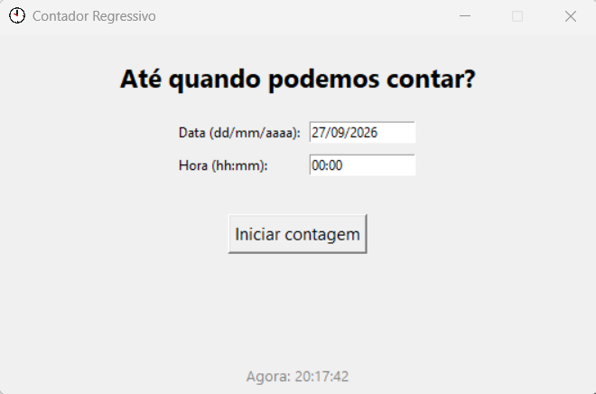
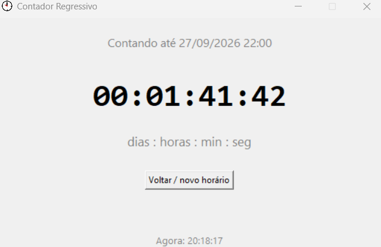

# Contador Regressivo

Aplicativo desktop para Windows, feito em Python, com objetivo de contar o tempo restante até
uma data e hora escolhidas por quem usa — avisando com som e mensagem na tela
quando o tempo chega ao fim.


## Por que esse projeto

A ideia de criar um projeto/app de contagem regressiva partiu de uma viagem que estava marcada para acontecer e com frequência eu contava os dias, até que veio a ideia de automatizar essa espera com um app que mostrasse quanto tempo faltava e sinalizasse quando o tempo chegasse ao fim.

## Capturas de tela




## Funcionalidades

- Define uma data e hora alvo (`dd/mm/aaaa` e `hh:mm`), com validação de formato e de data no futuro
- Mostra a contagem em tempo real, no formato `dias : horas : minutos : segundos`
- Relógio com a hora atual, sempre visível na tela
- Dispara som + mensagem na tela quando o tempo chega a zero
- Ícone personalizado, tanto na janela quanto no executável
- Roda como `.exe` standalone no Windows — quem for usar não precisa ter Python instalado
- Continua rodando em segundo plano (ícone na bandeja do sistema) mesmo com a janela fechada
- Salva o estado da contagem em disco — sobrevive mesmo fechando o app por completo
- Reabre automaticamente no login do Windows se havia uma contagem ativa, disparando o alarme mesmo que o horário já tenha passado enquanto o PC estava desligado

## Decisões técnicas

Alguns pontos do projeto que exigiram mais do que "só fazer funcionar":

- **Lógica separada da interface** — `countdown_logic.py` não depende do Tkinter;
  todo o cálculo de tempo e validação de data vive isolado, testável e reutilizável
  independente da interface gráfica.
- **Empacotamento como executável standalone** — usando PyInstaller, incluindo
  resolução de caminho de arquivos estáticos em runtime (`sys._MEIPASS`), já que
  uma aplicação empacotada roda a partir de uma pasta temporária diferente de onde
  o código-fonte está.
- **Ícone customizado** — contornando uma limitação do Tkinter no Windows para
  carregar `.ico`, usando `PhotoImage`/`iconphoto` no lugar de `iconbitmap`.
- **Execução em segundo plano** — usando `pystray` para o ícone de bandeja
  (rodando em thread separada, já que sua API é bloqueante) e interceptando
  o fechamento da janela (`WM_DELETE_WINDOW`) para escondê-la em vez de
  encerrar o processo.
- **Persistência entre execuções** — o estado da contagem é salvo em
  `%APPDATA%`, o local correto no Windows para dados de usuário (evita
  problemas de permissão de escrita que ocorreriam salvando ao lado do
  `.exe`).
- **Recuperação automática** — o app se registra na inicialização do Windows
  (via Registro, `HKEY_CURRENT_USER`) enquanto há uma contagem ativa, e se
  remove de lá assim que ela termina ou é cancelada.

## Tecnologias

- Python 3.14
- Tkinter (interface gráfica)
- PyInstaller (empacotamento em `.exe`)
- Pillow (usado no processo de build, para o ícone)
- pystray (ícone na bandeja do sistema)

## Como usar (sem instalar nada)

> O executável não vem junto no repositório (arquivos de build não ficam versionados
> no Git). Baixe a versão mais recente na aba [Releases](../../releases) deste
> repositório.

1. Baixe o `ContadorRegressivo.exe`
2. Clique duas vezes para abrir
3. Defina a data/hora e clique em **Iniciar contagem**

> ⚠️ Como o app se registra na inicialização do Windows enquanto há uma
> contagem ativa, é comum o antivírus/SmartScreen exibir um aviso ao abrir o
> `.exe` pela primeira vez. Isso acontece porque o executável não possui
> assinatura digital (processo pago, incomum em projetos pessoais) — não
> porque há algo malicioso nele. Clique em **"Mais informações"** →
> **"Executar assim mesmo"**.

## Rodando a partir do código-fonte

Pré-requisitos: Python 3.14+

```powershell
git clone https://github.com/BrunaDM-tech/App_contador.git
cd App_contador

python -m venv venv
venv\Scripts\activate

pip install -r requirements.txt

python countdown_gui.py
```

## Gerando o .exe você mesmo

O projeto já vem com um arquivo `.spec` configurado (nome do executável, ícone, etc).

```powershell
venv\Scripts\activate
pip install -r requirements.txt

pyinstaller ContadorRegressivo.spec
```

O executável final fica em `dist/ContadorRegressivo.exe`.

> Se for refazer o build do zero (por exemplo, depois de trocar o ícone), apague as
> pastas `build/` e `dist/` antes de rodar o `pyinstaller` de novo, para evitar cache
> de builds antigos:
>
> ```powershell
> Remove-Item -Recurse -Force build
> Remove-Item -Recurse -Force dist
> pyinstaller ContadorRegressivo.spec
> ```

## Estrutura do projeto

```
app_contador/
├── countdown_gui.py         # Interface gráfica (Tkinter), bandeja e orquestração geral
├── countdown_logic.py       # Lógica de cálculo do tempo restante
├── app_state.py             # Salva/carrega a contagem entre execuções (%APPDATA%)
├── windows_startup.py       # Registra/remove o app da inicialização do Windows
├── relogio.ico               # Ícone do executável e para o build
├── relogio.png                # Ícone da janela em tempo de execução
├── ContadorRegressivo.spec  # Configuração de build do PyInstaller
└── requirements.txt
```